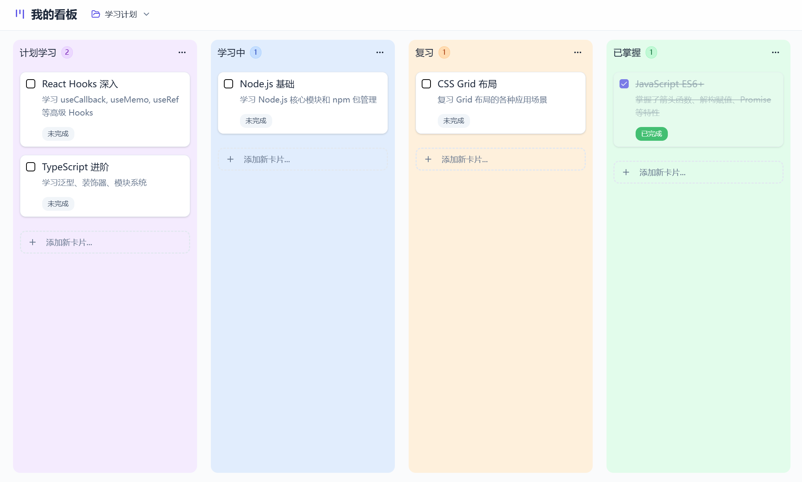

# ZeTodo - 现代化看板任务管理工具

<div align="center">
  
</div>

<div align="center">
  <p>
    <a href="https://heihuzicity-todo.figma.site/" target="_blank">
      🌐 <strong>在线体验 Live Demo</strong>
    </a>
    ·
    <a href="https://www.heihuzicity.com/" target="_blank">
      👨‍💻 <strong>作者网站</strong>
    </a>
  </p>
</div>

一个功能强大、界面优雅的看板式任务管理工具，支持多项目管理、拖拽排序、实时协作等功能。基于 React + TypeScript 构建，提供流畅的用户体验。

## ✨ 核心功能

### 🚀 看板管理
- **拖拽式操作**: 支持卡片在列间拖拽移动，操作直观流畅
- **自定义列**: 可自由添加、编辑、删除看板列，支持自定义颜色主题
- **卡片详情**: 完整的卡片编辑功能，支持标题、描述、完成状态等
- **快速添加**: 一键快速添加新卡片，提升工作效率

### 📊 多项目支持
- **项目切换**: 支持多个项目并行管理，一键切换不同工作空间
- **默认模板**: 提供个人备忘、工作项目、学习计划等默认项目模板
- **项目管理**: 完整的项目增删改功能，支持项目描述和时间追踪

### 🔍 智能搜索与筛选
- **关键词搜索**: 支持按标题和描述内容搜索卡片
- **列筛选**: 可按指定看板列筛选显示卡片
- **实时过滤**: 搜索结果实时更新，无需等待

### 📈 数据统计与导出
- **活动追踪**: 记录所有操作历史，包括卡片创建、移动、完成等
- **统计面板**: 显示项目进度、完成率等关键指标
- **数据导出**: 支持导出看板数据，便于备份和分析

### 🎨 界面与体验
- **现代化设计**: 采用 Radix UI 组件库，界面清爽专业
- **响应式布局**: 适配不同屏幕尺寸，支持移动端访问
- **主题定制**: 支持深色模式和自定义颜色主题
- **流畅动画**: 精心设计的交互动画，提升用户体验

## 🛠️ 技术栈

- **前端框架**: React 18.3.1 + TypeScript
- **构建工具**: Vite 6.3.5 (快速开发与构建)
- **UI 组件**: Radix UI (无障碍、可定制的组件库)
- **拖拽功能**: React DnD (强大的拖拽交互)
- **样式方案**: Tailwind CSS (原子化CSS框架)
- **状态管理**: Custom Hooks + LocalStorage
- **图标库**: Lucide React (现代化图标)
- **通知系统**: Sonner (优雅的Toast通知)

## 🚀 快速开始

### 环境要求
- Node.js >= 16.0.0
- npm >= 7.0.0

### 安装运行

```bash
# 安装依赖
npm install

# 启动开发服务器
npm run dev

# 构建生产版本
npm run build
```

访问 `http://localhost:3000` 即可使用应用。

## 📁 项目结构

```
ZeTodo/
├── src/
│   ├── App.tsx                    # 主应用组件
│   ├── main.tsx                   # 应用入口
│   ├── components/                # 组件目录
│   │   ├── ui/                   # 基础UI组件(Radix UI)
│   │   ├── KanbanColumn.tsx      # 看板列组件
│   │   ├── KanbanCard*.tsx       # 各种卡片组件
│   │   ├── ProjectSelector.tsx   # 项目选择器
│   │   ├── SearchFilter.tsx      # 搜索过滤组件
│   │   ├── ActivityPanel.tsx     # 活动面板
│   │   ├── StatisticsPanel.tsx   # 统计面板
│   │   ├── ExportMenu.tsx        # 导出菜单
│   │   └── ...                   # 其他功能组件
│   ├── hooks/                    # 自定义Hooks
│   │   ├── useKanbanStore.ts    # 看板状态管理
│   │   ├── useProjectStore.ts   # 项目状态管理
│   │   ├── useAutoScroll.ts     # 自动滚动Hook
│   │   └── useLocalStorage.ts   # 本地存储Hook
│   ├── types/
│   │   └── kanban.ts            # TypeScript类型定义
│   ├── styles/                  # 样式文件
│   └── guidelines/              # 开发指南
├── package.json                 # 项目配置
├── vite.config.ts              # Vite配置
├── index.html                  # HTML模板
└── README.md                   # 项目说明
```

## 💾 数据存储

应用使用浏览器 LocalStorage 进行数据持久化，包括：

- **看板数据**: `kanban-board-{projectId}`
- **活动记录**: `kanban-activities-{projectId}`
- **项目列表**: `kanban-projects`
- **当前项目**: `kanban-current-project`

数据格式遵循 TypeScript 类型定义，确保类型安全。

## 🎯 使用指南

### 基础操作
1. **创建项目**: 点击项目选择器创建新的工作空间
2. **管理看板列**: 添加、编辑、删除看板列，设置颜色主题
3. **操作卡片**: 通过拖拽移动卡片，双击编辑详情
4. **搜索筛选**: 使用搜索栏快速定位所需卡片

### 高级功能
1. **数据导出**: 通过导出菜单备份项目数据
2. **活动追踪**: 查看所有操作历史和项目进度
3. **批量操作**: 支持多选和批量操作卡片

## 🔧 自定义与扩展

### 添加新的卡片类型
```typescript
// 在 types/kanban.ts 中扩展 Card 接口
export interface Card {
  // ... 现有属性
  priority?: 'low' | 'medium' | 'high';
  tags?: string[];
}
```

### 自定义主题颜色
修改 `src/components/ColumnColorPicker.tsx` 中的颜色配置：

```typescript
const colorOptions = [
  { name: 'purple', class: 'bg-purple-100', label: '紫色' },
  // 添加更多颜色选项
];
```

## 🤝 贡献指南

欢迎提交 Issue 和 Pull Request！

1. Fork 本仓库
2. 创建特性分支: `git checkout -b feature/AmazingFeature`
3. 提交更改: `git commit -m 'Add some AmazingFeature'`
4. 推送分支: `git push origin feature/AmazingFeature`
5. 提交 Pull Request

## 📝 开发说明

- 遵循 React Hooks 最佳实践
- 使用 TypeScript 严格模式
- 组件采用函数式设计
- 状态管理基于自定义 Hooks
- UI 组件基于 Radix UI 构建

## 📄 许可证

本项目基于 MIT 许可证开源。

---

<div align="center">
  <p>用 ❤️ 打造的现代化任务管理工具</p>
</div>