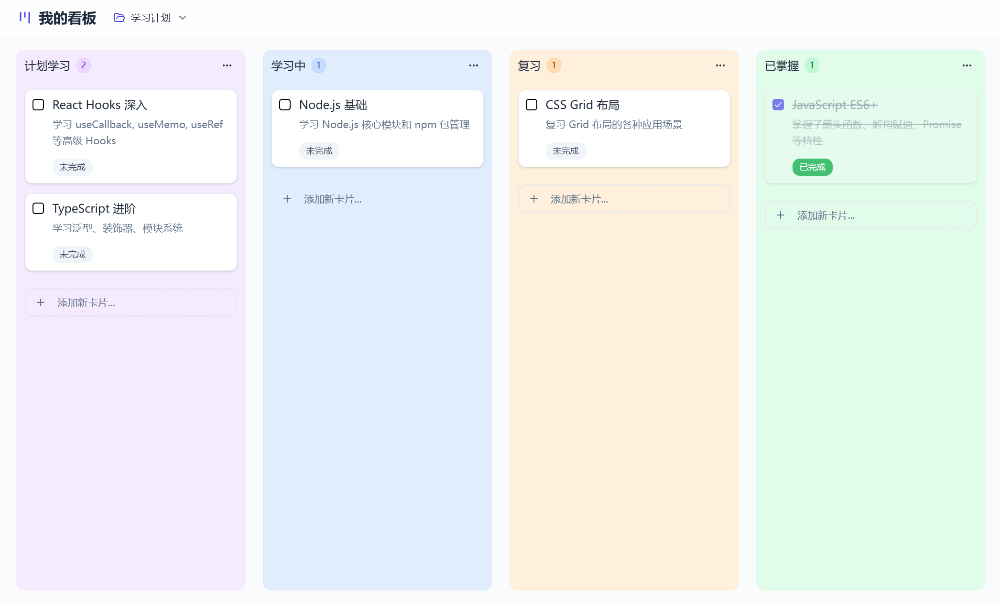

# ZeTodo - 现代化看板任务管理工具

<div align="center">
  
</div>

<div align="center">
  <p>
    <a href="https://heihuzicity-todo.figma.site/" target="_blank">
      🌐 <strong>在线体验</strong>
    </a>
    ·
    <a href="https://www.heihuzicity.com/" target="_blank">
      👨‍💻 <strong>作者网站</strong>
    </a>
  </p>
</div>

一个本地优先的桌面看板任务管理工具，支持多项目管理、拖拽排序、卡片详情编辑和 SQLite 持久化。前端基于 React + TypeScript，桌面端由 Tauri + Rust 提供本地能力。

## 核心功能

- 多项目管理：创建、编辑、删除和切换项目。
- 看板列管理：添加、编辑、删除列，并配置列颜色。
- 卡片管理：维护标题、描述、完成状态、优先级和日期。
- 拖拽排序：基于 `@dnd-kit` 支持卡片同列和跨列移动。
- 本地存储：数据通过 Tauri 后端写入 SQLite。

## 技术栈

- **前端框架**: React 18.3.1 + TypeScript
- **构建工具**: Vite 6.3.5
- **桌面框架**: Tauri 2 + Rust
- **本地数据库**: SQLite (rusqlite bundled)
- **界面组件**: Radix UI 风格组件 + Lucide React
- **拖拽功能**: @dnd-kit
- **状态管理**: 自定义 Hooks + Tauri 调用封装
- **通知系统**: Sonner

## 快速开始

### 环境要求
- Node.js >= 18.0.0
- npm >= 7.0.0
- Rust >= 1.77.2 (运行或构建 Tauri 桌面端时需要)

### 安装运行

```bash
# 安装依赖
npm install

# 启动开发服务器
npm run dev

# 构建生产版本
npm run build

# 启动 Tauri 桌面开发模式
npm run tauri:dev

# 构建 Tauri 桌面安装包
npm run tauri:build
```

Web 开发服务器默认运行在 `http://localhost:5173`。

## 项目文档

- [项目说明](docs/项目说明.md): 当前架构、数据流、关键目录和维护约定。

## 项目结构

```
ZeTodo/
├── src/
│   ├── App.tsx                    # 主应用组件
│   ├── main.tsx                   # 应用入口
│   ├── components/                # 组件目录
│   │   ├── ui/                   # 基础UI组件(Radix UI)
│   │   ├── KanbanColumn.tsx      # 看板列组件
│   │   ├── KanbanCard*.tsx       # 各种卡片组件
│   │   ├── ProjectSelector.tsx   # 项目选择器
│   │   ├── CardDetailsDialog.tsx # 卡片详情弹窗
│   │   ├── DragOverlayCard.tsx   # 拖拽预览卡片
│   │   └── ...                   # 其他功能组件
│   ├── hooks/                    # 自定义Hooks
│   │   ├── useKanbanStore.ts    # 看板状态管理与卡片操作
│   │   ├── useProjectStore.ts   # 项目状态管理
│   │   └── ...                  # 其他辅助 Hooks
│   ├── lib/
│   │   ├── api/                 # Tauri invoke API 封装
│   │   ├── query/               # TanStack Query 配置与封装
│   │   └── schemas/             # Zod 数据结构定义
│   ├── types/
│   │   └── kanban.ts            # TypeScript类型定义
│   ├── styles/                  # 样式文件
│   ├── 开发指南.md              # 开发约定
│   └── 致谢.md                  # 第三方素材与组件致谢
├── src-tauri/                   # Tauri + Rust 后端
│   ├── src/
│   │   ├── commands/            # Tauri 命令入口
│   │   └── db/                  # SQLite 初始化、迁移与 CRUD
│   ├── Cargo.toml               # Rust 依赖配置
│   └── tauri.conf.json          # Tauri 应用配置
├── docs/
│   └── 项目说明.md              # 当前项目说明
├── package.json                 # 项目配置
├── vite.config.ts              # Vite配置
├── index.html                  # HTML模板
└── README.md                   # 项目说明
```

## 开发说明

- 遵循 React Hooks 最佳实践
- 使用 TypeScript 严格模式
- 组件采用函数式设计，业务状态放在 Hooks 中编排
- 数据读写通过 Tauri 调用封装进入 Rust 后端
- Rust 后端负责 SQLite 初始化、迁移和 CRUD 命令
- 文档只描述当前已接入主流程的能力

## 许可证

本项目基于 MIT 许可证开源。

---

<div align="center">
  <p>用 ❤️ 打造的现代化任务管理工具</p>
</div>
